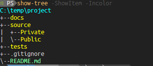
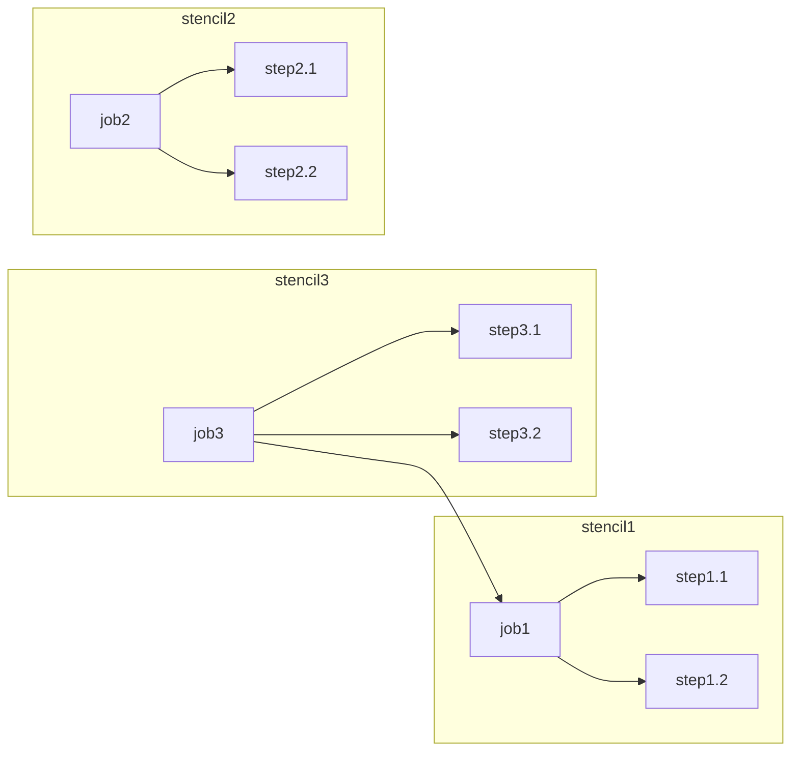

## Overview

stencil is a scaffolding system like Plaster.  Call `Invoke-Stencil <stencil_name>` and it will execute the
instructions defined in that job.  It takes some ideas from Plaster, and others from Github Actions.

---
🙋‍♀️ ***why?***

[Plaster](https://github.com/PowerShellOrg/Plaster) is *ok*, but I really have a hard time with XML, and the
constrained environment within Plaster means that the user is very limited in dynamically generating projects and
files.  Also, there is no way to "modularize" plaster... if you want to break up a project into multiple templates,
then each of those templates requires a call to `Invoke-Plaster` by the user.

---

Stencil is an attempt to overcome these (personal) limitations.

---

>Also, it looks like the last update to Plaster was 2021-10-04  ...

## Synopsis

Stencil performs operations specified in a "manifest" file written in YAML.  The manifest groups operations into
steps, and steps into jobs which are called at invocation time.

If you are familiar with Plaster's methodology of listing available Templates with `Get-PlasterTemplate` and then
running it with `Invoke-Plaster`, then stencil will feel very familiar.

Likewise, if you are familiar with Github Action workflow syntax, then stencil's manifest will be familiar too

---
to create this project:



the manifest could look like this:
```yaml
# - stencil.yml
name: BasicProject
desc: >
  Create a basic project directory structure
jobs:
  job1:
   steps:
     - tree:
        root: ${CurrentDir}
        docs:
        source:
          Public:
          Private:
        tests:
    - copy:
       Path: ${SourceDir}/_gitignore
       Destination: ${CurrentDir}/.gitignore
    - copy:
       Path: ${SourceDir}/README.md
       Destination: ${CurrentDir}
```


## Description

Stencil helps you create new projects, and add or modify existing files and folders using a simple Domain Specific
Language (DSL).  Stencil comes with some operations that cover the basics such as `copy` which copies files and/or
directories from the Stencil to the destination folder.  See the "Operations" section below for a list of all of the
included operations.

The individual operations can be combined together to create a `job` like GitHub Actions, and jobs can use other
jobs as part of their steps.  For example, "job3" calls "step3.1", "step3.2", and "job1" like this:

**Stencil Directory**



## Components

### Stencil

In this module, a `Stencil` is a folder containing:

- One manifest file
- Zero or more supporting folders and files

This is analogous to a "Template" in the Plaster module.  However, unlike Plaster templates, Stencils can be
combined together and share "state", so you can mix-and-match them to create complex projects based on your needs at
run-time.

Although a `Stencil` is a component, the stencil module makes no restriction as to how you want to organize your
jobs.  You could create one `Stencil` with all your jobs defined in the one manifest and all the supporting files
and folders along side it.  Or you could have separate `Stencil`s for each "type" of project.  When you use the
functions in the stencil module, the basic unit is a `job`

#### Manifest

The stencil manifest is it's "runbook".  It is a YAML file and by default it is named 'stencil.yml'.  It provides the `Stencil` metadata (name, description, version, etc.), and
the job definitions.  This is where jobs get their `${SourceDir}` property from, so that you can use your supporting
files and folders in the operations.  (For a list of properties that a job has available, see the "Variables
section)

#### Supporting folders and files

Any directories or files that you want to copy to the destination, templates that you want to expand, or scripts you
want to run from within your job should be placed in the folder along side the manifest.  The `${SourceDir}` is
relative to `stencil.yml`.  So for example, if you want to copy a `.gitignore` file from the `Stencil` to your
project, the manifest contains this:

```yaml
# stencil.yml
# ...
jobs:
  job1:
    steps:
      - copy:
          Path: ${SourceDir}/dot_gitignore
          Destination: ${CurrentDir}/.gitignore
      #...
```

Then your `Stencil` directory would look like this:

```output
+ ~/.stencil/gitignore
|- stencil.yml
|- dot_gitignore
....
```

### Job

A job is a collection of actions to perform, and it is the main object of the stencil module.  It can be used as an
object on the pipeline, and is of type `[Stencil.JobInfo]`.  A job has it's own set of variables (the "environment")
so that the actions can share state with each other. Because a job can be reused by other jobs, it
***must be unique*** across all of the `Stencil`s loaded *in this session*.

Each action that a job should take is defined in the 'steps' array.  A step can be an operation or another job.

### Operations

An operation is the atomic unit of stencil.  An operation is basically a "wrapper" around a function or scriptblock,
and represents a single action to perform.  The stencil module comes with some operations built in:

- **Copy**

  Copy the contents of a directory or file from source to destination.  These are "static" files and directories.

- **New**

  Create a file or directory

- **Tree**

  "shortcut" to create a directory structure (rather than several "new"s)

- **Read**

  Ask for information.  Either from the user or a config file

- **Expand**

  Copy the content of a file to a new file, replacing tokens

- **Invoke**

  Run a script or command
